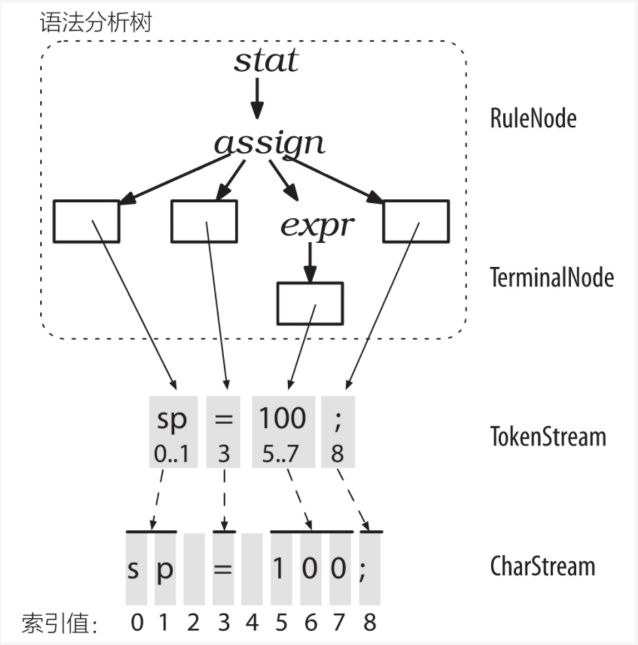
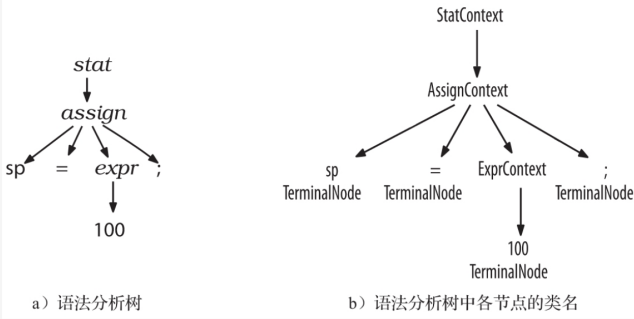
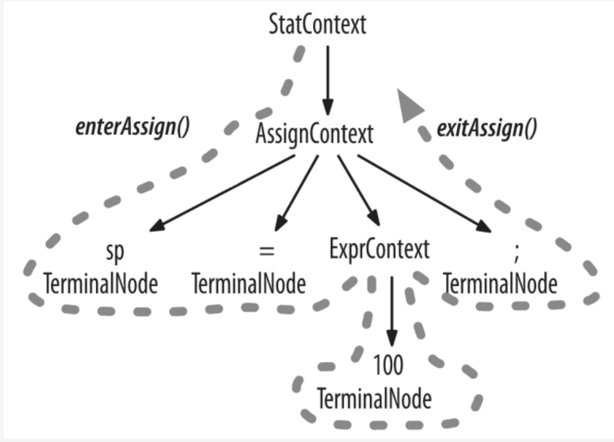
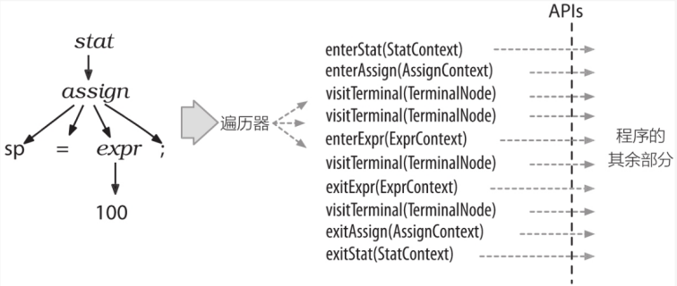
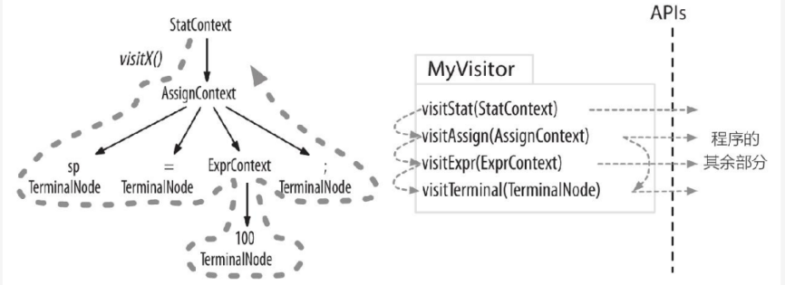

# 安装及测试
## 命令行

https://blog.csdn.net/weixin_52224421/article/details/124900287

## idea中

1.下载并配置Maven

2.在idea中新建一个Maven项目，点击 文件-项目结构 添加antlr4的jar包即可(注意：java默认package源根地址在./src/main/java处)

# 编译

## 命令行

如上教程创建antlr4.bat和grun.bat，并添加到系统path中

假设我们创建了名为Hello.g4的文件，依次输入以下命令

```
antlr4 Hello.g4
javac Hello*.java
grun Hello rr -tree(rr为Hello.g4中想要匹配的规则的名称)(接下来输入要匹配的文本，以ctrl z结束)
grun Hello rr -gui(接下来输入和上述一样的文本，以ctrl z结束)
```

成功的话将会显示语法分析树的图形化界面

-tree：生成语法分析树

-gui：在对话框中以可视化方式显示语法分析树

## idea中

1.测试

在idea中装.g4文件的插件，在.g4文件中需要测试的规则处右键，再点击 Test Rule xxx 即可直接测试

2.生成相应文件

在idea中，右击.g4文件，Configure ANTLR出配置输出路径

再右击.g4文件，Generate ANTLR Recognizer

https://blog.csdn.net/Sisyphus_98/article/details/105518652

3.使用Maven管理项目

https://blog.csdn.net/m0_67392409/article/details/124108014


# 基本语法

参考书目：《antlr4语法指南》

一些术语：语言，语法，语法分析树，token(词素)，lexer，parser，前向预测(语法分析器通过接下来的token预测选择向哪递归)


使用实例 Hello.g4

```
// Define a grammar called Hello
grammar Hello;
r:'Hello' ID;         // match keyword hello followed by an identifier
ID:[a-z]+;             // match lower-case identifiers
WS:[ \t\r\n]+ -> skip; // skip spaces, tabs, newlines
```

使用实例 Expr.g4

```
grammar Expr;
prog: stat+;
stat: expr NEWLINE				#printExpr
	| ID '=' expr NEWLINE		#assign
	| NEWLINE					#blank
	;
expr: expr op=('*'|'/') expr		#MulDiv
	| expr op=('+'|'-') expr		#AddSub
	| INT						#int
	| ID						#id
	| '(' expr ')'				#parens
	;
ID: [a-zA-Z]+;
INT: [0-9]+;
NEWLINE: '\r'? '\n';

MUL: '*';
DID: '/';
ADD: '+';
SUB: '-';

WS: [ \t\r\n]+ -> skip;
```


**一些基本语法 ** 

```
/*词法*/
ID1:[a-z]+;//重复至少一次,（方括号表示匹配其中一个字符）
ID2:[a-z]*;//重复任意多次（可以为0次） 
ID3:~[a-z];//除了a-z都匹配，取反符号后面必须是单个字符或[]组成的单个字符的集合 (\n取反要加[]，即~[\n]) （若后接()，且()内都为单个字符也合法 ）
	即可以的形式有 ~a,~'a',~[ab],~('a'|'b'),~'\n'
ID4:('a'|'bb')*;//匹配'a'或'bb'，重复任意多次
ID5 'ab'? 'cd';// 'ab'?表示匹配'ab'或者忽略它
STRING:'"' .*? '"';//'.'可以匹配任意字符,若是不加问号默认为贪婪匹配，加了问号表示改为非贪婪匹配(懒惰匹配)
	即 若是使用贪婪匹配，则 "sss" "sss" 会被匹配成一个STRING
	而若是使用懒惰匹配，"sss" "sss"会被匹配成两个STRING
WS: ->skip; //->skip表示在lexer解析完成后，把该类型的token全部删去
	
/*句法*/
expr: expr op=('*'|'/') expr		#MulDiv
	| expr op=('+'|'-') expr		#AddSub
	| INT						#int
	| ID						#id
	| '(' expr ')'				#parens
	;
//多个备选分支
//#后面表示某一分支的标签(请让标签和规则名都独一无二)
//expr op=('*'|'/') expr 表示在这个语句里，把('*'|'/')命名为op
ttt	:INT_CONSTANT
	|<assoc=right>ttt '+' ttt//右结合(antlr4默认为左结合)
	;
```


**一些注意点** 

- 大写字母开头为句法，小写字母开头为词法

- lexer在词法规则下确定token流，parser再对lexer给出的一串词法记号流(解析过的token流)进行分析

- antlr4的parser可以处理直接左递归，但仍不能处理间接左递归

  备选方案被antlr4分成以下几种

  1.expr:expr op expr;//二元(其中op是单词法符号或多词法符号构成的运算符)

  2.expr:expr op1 expr op2 expr;//三元(其中op必须是单词法符号)

  3.expr:elements expr;//一元前缀

  4.expr:expr elements;//一元后缀

  5.除此之外的其他备选分支//主表达式(例如标识符和整数，也包括 '(' expr ')' )  (注：主表达式没有优先级，即放在任何位置都一样)

  其中直接左递归包含1，2，4三类，注：不在1,2中的直接左递归全部归为第4类(elements中可以再直接或间接调用expr)


- 句法/词法不能有歧义，歧义可以通过优先级解决并利用

  1.词法歧义，首先lexer会选择匹配可能的最长字符串（贪婪匹配），在长度相同的基础上，antlr会选择最靠前的备选分支

  2.句法歧义，其中关于 "二元"形式的直接左递归，antlr会选择最靠前的句法规则。但除了这样的一部分句法歧义可通过优先级消除，一般是不行的

     尽管antlr4可以处理一部分句法歧义，但尽量还是不要出现不确定antlr4是否能解决的句法歧义，即不要故意刁难antlr4

  ```
  Begin:'begin';
  ID:[a-z]+;
  ```

  若匹配begin，会匹配Begin

  若匹配beginner，会匹配ID,而不是拆成begin+ner去匹配Begin+ID

  但若是匹配begin ner，会匹配Begin+ID

- 当文件过长时，可以考虑将.g4文件分为多份文件，用import合并(一种选择是将句法和词法分成两个.g4文件)


# 调用生成的语法分析树(.java文件)

## 生成的.java文件

XXXLexer.java和XXXparser.java为根据XXX.g4文件中的词法/句法生成的lexer/parser

XXXListener.java提供了listener监听器的基类(虚类)，XXXBaseListener.java提供了listener监听器的默认实现类(从XXXListener.java中派生而来)

XXXVisitor.java提供了Visitor访问器的基类(虚类)，XXXBaseVisitor.java提供了Visitor访问器的默认实现类(从XXXVisitor.java中派生而来)

## 语法分析树

对于语法分析树中的每一个非叶节点(规则)，都会生成一个单独的RuleNode的子类，如规则stat会生成StatContext的类

对于语法分析树中的每一个叶节点(词素)，都会生成一个TerminalNode类

RuleNode和TerminalNode都是ParseTree的子类








## listener 监听器

antlr为每个语法文件生成一个ParseTreeListener的子类

该类中，每一个非叶节点(规则)都有一个单独的enter方法和exit方法，如规则stat会生成enterStat(),exitStat()





antlr运行库提供ParseTreeWalker类，它会对语法分析树进行DFS，依次执行每个规则的enter方法和exit方法

listener的优秀之处在于，DFS是自动进行的，即我们不需要写DFS相关的代码





## vistor 访问器

每一个非叶节点(规则)都有一个单独的visit方法，如规则stat会生成vistStat()

特别的，叶节点(token)也有一个visit方法，名为visitTerminal()


antlr运行库提供MyVisitor类，通过调用visit()方法开始对语法分析树进行一次DFS





## 在Java main函数中调用

```
public static void main(String[] args) throws Exception {
        CharStream input = CharStreams.fromFileName("./src/main/java/org/compiler_design/source_code.in");//新建一个CharStream读取数据
        HelloLexer lexer=new HelloLexer(input);//创建一个lexer 处理输入数据
        CommonTokenStream tokens=new CommonTokenStream(lexer);//创建一个token缓冲区 储存lexer生成的词法符号
        HelloParser parser=new HelloParser(tokens);//创建一个parser 处理token缓冲区中的内容为解析做准备工作
        ParseTree tree=parser.rr();//用Hello.g4中的rr规则对得到的token流进行句法分析
        System.out.println(tree.toStringTree(parser));//用Lisp风格打印生成的树
    }
```


# 简单实例Expr(Visitor)

**Expr.g4** 

```
grammar Expr;
prog: stat+;
stat: expr NEWLINE				#printExpr
	| ID '=' expr NEWLINE		#assign
	| NEWLINE					#blank
	;
expr: expr op=('*'|'/') expr		#MulDiv
	| expr op=('+'|'-') expr		#AddSub
	| INT						#int
	| ID						#id
	| '(' expr ')'				#parens
	;
ID: [a-zA-Z]+;
INT: [0-9]+;
NEWLINE: '\r'? '\n';

MUL: '*';
DID: '/';
ADD: '+';
SUB: '-';

WS: [ \t\r\n]+ -> skip;
```

用antlr4生成Expr.g4对应的java文件

**EvalVisitor.java**  

```
package org.Expr;
import org.Expr.antlr_out.*;
import org.antlr.v4.runtime.*;
import org.antlr.v4.runtime.tree.*;

import java.util.HashMap;
import java.util.Map;

public class EvalVisitor extends ExprBaseVisitor<Integer> {
   HashMap<String,Integer> memory=new HashMap<String,Integer>();
// prog: stat+;
   @Override public Integer visitProg(ExprParser.ProgContext ctx) {
      return visitChildren(ctx);
   }
// stat: expr NEWLINE          #printExpr
   @Override public Integer visitPrintExpr(ExprParser.PrintExprContext ctx) {
      Integer value=visit(ctx.expr());
      System.out.println(value);
      return 0;
   }
// stat: ID '=' expr NEWLINE     #assign
   @Override public Integer visitAssign(ExprParser.AssignContext ctx) {
      String id=ctx.ID().getText();
      int value=visit(ctx.expr());
      memory.put(id,value);
      return value;
   }
// stat: NEWLINE              #blank
   @Override public Integer visitBlank(ExprParser.BlankContext ctx) { return 0; }
// expr: '(' expr ')'          #parens
   @Override public Integer visitParens(ExprParser.ParensContext ctx) {
      return visit(ctx.expr());
   }
// expr: expr ('*'|'/') expr     #MulDiv
   @Override public Integer visitMulDiv(ExprParser.MulDivContext ctx) {
      int left=visit(ctx.expr(0));
      int right=visit(ctx.expr(1));
      if(ctx.op.getType()==ExprParser.MUL)return left*right;
      else return left/right;
   }
// expr: expr op=('+'|'-') expr      #AddSub
   @Override public Integer visitAddSub(ExprParser.AddSubContext ctx) {
      int left=visit(ctx.expr(0));
      int right=visit(ctx.expr(1));
      if(ctx.op.getType()==ExprParser.ADD)return left+right;
      else return left-right;
   }
// expr: ID                  #id
   @Override public Integer visitId(ExprParser.IdContext ctx) {
      String id=ctx.ID().getText();
      if(memory.containsKey(id))return memory.get(id);
      return -1;
   }
// expr: INT                 #int
   @Override public Integer visitInt(ExprParser.IntContext ctx) {
      return Integer.valueOf(ctx.INT().getText());
   }
}
```

**test.java** 

```
package org.Expr;
import org.Expr.antlr_out.*;
import org.antlr.v4.runtime.*;
import org.antlr.v4.runtime.tree.*;

public class test {
    public static void main(String[] args) throws Exception {
        CharStream input = CharStreams.fromFileName("./src/main/java/org/Expr/source_code.in");//新建一个CharStream读取数据
        System.out.println(input);
        System.out.println("-----------");
        ExprLexer lexer=new ExprLexer(input);//创建一个lexer 处理输入数据
        CommonTokenStream tokens=new CommonTokenStream(lexer);//创建一个token缓冲区 储存lexer生成的词法符号
        ExprParser parser=new ExprParser(tokens);//创建一个parser 处理token缓冲区中的内容为解析做准备工作
        ParseTree tree=parser.prog();//用Expr.g4中的prog规则对得到的token流进行句法分析
//        System.out.println(tree.toStringTree(parser));//用Lisp风格打印生成的树
        EvalVisitor visitor=new EvalVisitor();//新建一个自定义的EvalVisitor类
        visitor.visit(tree);//开始用自定义的方法visit该语法分析树
    }
}
```

* 对于每一个token，包括明确写出词法定义的(如MUL: '*';) 和 在句法选择分支中出现但没有明确写出句法定义的( ID '=' expr NEWLINE 中的'=')，都对应一个整数值，且MUL和'\*'对应的值是同一个(即确定字符为map对应)

* **Expr.g4** 中通过单独定义MUL:'*'，可实现 **EvalVisitor.java** 中对MUL和DIV的分类，即可通过if(ctx.op.getType()==ExprParser.ADD) 判断op对应的token类型(if中左右皆为Integer)

* 对于通过antlr4生成的ExprBaseVIsitor
  * 1.若选择分支只有一个，如prog，ExprBaseVisitor中会生成一个visitProg方法
  *  2.若选择分支有多个，如stat，可通过对每个选择分支打标签，ExprBaseVisitor中会给每个标签都生成一个visitXXX方法,如visitPrintExpr,visitAssign,visitBlank
  *  特别的，若只有一个选择分支则不能打标签
  * 通过这样我们可以做到每个选择分支对应一个visitXXX方法

* 对于通过antlr4生成的ExprPaser

  和Visitor相同的，每个visitXXX对应的，生成一个XXXNode(antlr4生成的叫Context)

* 如**EvalVisitor.java** ，可通过对BaseVisitor类进行派生自定义Visitor类，当在main()中调用visitor.visit(tree)时，则会从根规则对应的方法进入，上例中为visitProg()

* 在每个visitXXX()方法中，可进入该选择分支中出现的子规则对应的方法( 形如visit(ctx.expr())/visit(ctx.expr(0))，其中若是子规则只出现一次使用前面的形式，若是子规则出现多次则还有带一个参数表示为第几个 )

* visit()函数的返回值即为进入的方法的返回值，返回值类型在派生时定义，上例中为Integer


